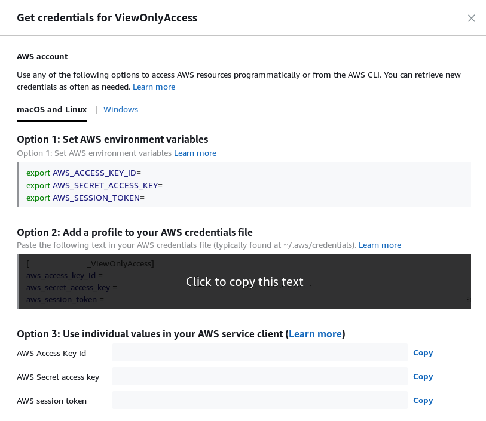

# AWS Credentials Updater

Automatically update your `~/.aws/credentials` file after copying credentials
from AWS console.

**Tested only on Ubuntu 18.04**.



## Installation

Install ACU for the current user:
```
pip3 install --user acu
```

To start ACU automatically, copy `acu.service` file to 
`~/.config/systemd/user/` and enable it:
```
mkdir -p ~/.config/systemd/user && cp acu.service ~/.config/systemd/user/
systemctl --user enable acu.service
systemctl --user start acu.service
```

Check service status:
```
systemctl --user status acu.service
```
